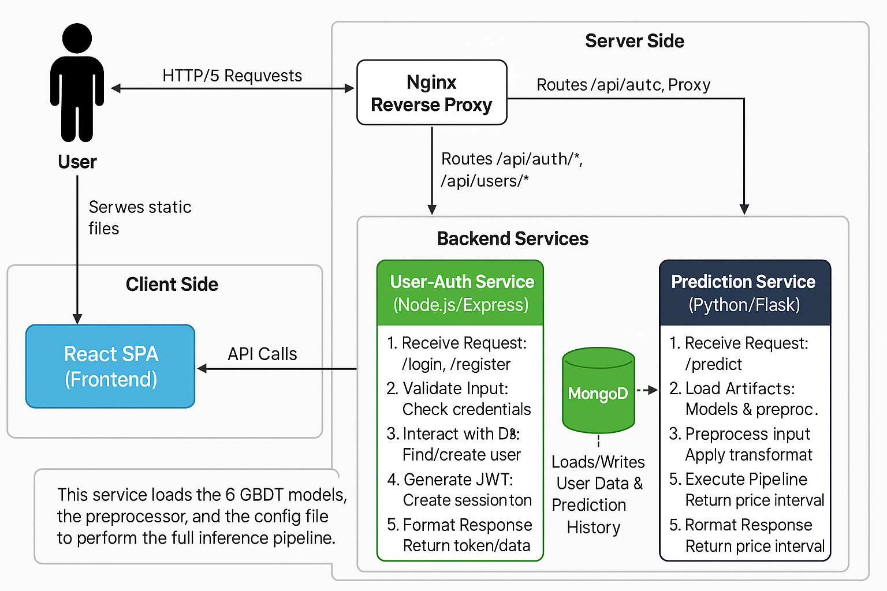

# HOMETRIX - HousePrice AI: Intelligent House Price Prediction

<div align="center">
  
  
  
  
  
  
  
</div>

---

**HOMETRIX** is a full-stack web application that provides highly accurate house price predictions using an advanced machine learning model. Developed as a comprehensive project, this application transforms a sophisticated Kaggle competition model into a user-friendly, feature-rich platform for real estate valuation.

The core innovation lies in its ability to provide a **prediction interval** (a confident lower and upper price bound) rather than a single-point estimate, offering a more realistic view of a property's market value.

## ✨ Core Features

- **Advanced ML Predictions:** Utilizes an ensemble of XGBoost, LightGBM, and CatBoost models.
- **Prediction Intervals:** Delivers a price range (lower and upper bounds) for a more confident valuation.
- **User Authentication:** Secure registration and login system with JWT-based authentication for local users and administrators.
- **Admin Dashboard:** A protected area for administrators to view all predictions and manage users.
- **Responsive Frontend:** A clean and modern user interface built with React and Tailwind CSS.
- **Containerized Deployment:** Fully containerized with Docker and Docker Compose for easy setup and deployment.

## 🏛️ System Architecture

This application is built using a **Microservices Architecture**, which separates concerns into independent, scalable services. This design enhances maintainability and allows for individual components to be updated without affecting the entire system.

<p align="center">
  
</p>

1.  **Frontend:** A React single-page application (SPA) that serves as the user interface. It communicates with the backend services via REST APIs.
2.  **User-Auth Service:** A Node.js/Express service responsible for user registration, login, JWT generation, and storing user data and prediction history in MongoDB.
3.  **Prediction Service:** A Python/Flask service that exposes the machine learning models. It receives house feature data, processes it, and returns the predicted price interval.
4.  **Nginx Reverse Proxy:** Manages incoming traffic and routes requests to the appropriate frontend or backend service. It also handles serving the static React build.
5.  **MongoDB Database:** A NoSQL database that stores user credentials and prediction history.

---

## 🏗️ Software Design and Engineering Principles

This project was built with a focus on creating a scalable, maintainable, and robust system, adhering to established software engineering principles.

### Architectural Style

- **Microservices Architecture:** The system is decomposed into small, independent services (`user-auth`, `prediction`) that communicate over well-defined APIs. This approach allows for independent development, deployment, and scaling of each component.

### Design Patterns

- **Model-View-Controller (MVC):** The `user-auth-service` follows a classic MVC pattern, separating the application logic into:
    - **Models (`User.js`):** Define the data schema and business logic (e.g., password hashing).
    - **Views:** The JSON data served by the API.
    - **Controllers (`authController.js`):** Handle incoming requests, interact with models, and return responses.
- **Middleware Pattern:** The Express.js services make extensive use of middleware for concerns like authentication (`authMiddleware.js`), logging, and error handling. This allows for a clean separation of cross-cutting concerns from the main business logic.
- **Repository Pattern:** The Mongoose models act as a repository, abstracting the underlying MongoDB database and providing a clean API for data access (`User.findOne()`, `User.create()`).

### Object-Oriented Programming (OOP) Concepts

- **Encapsulation:** The Mongoose `userSchema` encapsulates user data and related logic (like password hashing and comparison methods), hiding the implementation details from the rest of the application.
- **Abstraction:** The ML models in the `prediction_service` are loaded via `joblib`, abstracting away the complexity of the model's internal workings. The service's clients only need to interact with the simple `/predict` endpoint.
- **Inheritance:** Mongoose models inherit a rich set of functionalities (e.g., `save`, `find`) from the base `mongoose.Model` class, demonstrating reuse and extension.

### SOLID Principles

- **Single Responsibility Principle (SRP):** Each microservice has a single responsibility (e.g., user management, prediction). Within services, controllers, models, and middleware also have distinct, singular purposes.
- **Open/Closed Principle:** The middleware pattern allows the system to be extended with new functionality (e.g., adding a rate limiter) without modifying existing controller code.
- **Interface Segregation Principle (ISP):** The API is segregated into different route files (`authRoutes.js`, `userRoutes.js`), ensuring that clients only need to be aware of the endpoints relevant to their needs.
- **Dependency Inversion Principle (DIP):** The application depends on abstractions, not on concretions. For example, secret keys and database URIs are injected via environment variables (`process.env.JWT_SECRET`), decoupling the code from specific configuration details.

---

## 🛠️ Technology Stack

| Area                | Technologies                                                                                                                                                           |
| ------------------- | ---------------------------------------------------------------------------------------------------------------------------------------------------------------------- |
| **Frontend**        | `React`, `React Router`, `Tailwind CSS`, `Axios`, `Vite`                                                                                                                 |
| **Backend (Auth)**  | `Node.js`, `Express`, `MongoDB`, `Mongoose`, `JWT`, `bcryptjs`                                                                                                           |
| **Backend (ML)**    | `Python`, `Flask`, `Pandas`, `NumPy`, `Scikit-learn`, `XGBoost`, `LightGBM`, `CatBoost`                                                                                    |
| **DevOps**          | `Docker`, `Docker Compose`, `Nginx`                                                                                                                                      |
| **Linting/Quality** | `ESLint`, `Prettier` (recommended)                                                                                                                                       |

---

## 🚀 Getting Started

Follow these instructions to get the project up and running on your local machine for development and testing purposes.

### Prerequisites

- [Docker](https://www.docker.com/get-started)
- [Docker Compose](https://docs.docker.com/compose/install/) (usually included with Docker Desktop)

### Local Installation & Setup

1.  **Clone the repository:**
    ```bash
    git clone https://github.com/sanjayahewage0103/house-price-prediction-app.git
    cd house-price-prediction-app
    ```

2.  **Configure Environment Variables:**
    Create a `.env` file in the root of the `user-auth-service` directory (`user-auth-service/.env`). This file will hold your secret keys.

    ```ini
    # user-auth-service/.env

    # A long, random, and secret string for signing JWT tokens
    JWT_SECRET=your_super_secret_jwt_key

    # Your MongoDB connection string
    MONGO_URI=mongodb://mongo:27017/house-price-db
    ```
    *Note: The default `MONGO_URI` is configured to work with the Docker Compose setup.*

3.  **Build and Run with Docker Compose:**
    From the root project directory, run the following command. This will build the images for each service and start the containers.

    ```bash
    docker-compose up --build
    ```
    The `--build` flag ensures that the images are rebuilt if you make any changes to the Dockerfiles or source code.

4.  **Access the Application:**
    Once the containers are running, you can access the application in your browser:
    - **Frontend:** [http://localhost:80](http://localhost:80)

5.  **Create an Admin User (Optional):**
    To access the admin dashboard, you need to create a user with the `admin` role. You can do this by running the `create-admin.js` script inside the running `user-auth-service` container.

    ```bash
    # Find the container ID for the user-auth-service
    docker-compose ps

    # Execute the script inside the container
    docker exec -it <user-auth-service-container-id> node create-admin.js
    ```
    Follow the prompts to create your admin account.

---

## 🧪 Running Tests (Example)

To ensure code quality and prevent regressions, a full test suite should be implemented. Here is how you would run the tests for each service.

```bash
# For the User-Auth Service (Node.js)
docker-compose exec user-auth-service npm test

# For the Prediction Service (Python)
docker-compose exec prediction-service pytest

# For the Frontend (React)
docker-compose exec frontend npm test
```
*Note: Test scripts and configurations would need to be added to the project to enable this functionality.*

---

## ©️ License

This project is licensed under the terms of the [HOMETRIX - HousePrice AI License](./LICENSE). See the `LICENSE` file for full details.

---

## 🤝 Connect With Me

Let's connect! I'm always open to discussing new projects, creative ideas, or opportunities to be part of an amazing team.

<div align="center">
  <a href="mailto:pethumhewage66@gmail.com">
    
  </a>
  <a href="https://www.linkedin.com/in/pethumsanjayahewage0103">
    
  </a>
  <a href="https://www.instagram.com/_pethum_sanjaya">
    
  </a>
  <a href="https://www.facebook.com/sanjaya.hewage.sp">
    
  </a>
  <a href="https://github.com/sanjayahewage0103">
    
  </a>
</div>

---

## ©️ Copyright & Licensing

Copyright © 2025 Sanjaya Hewage (SP)

A creation of SP DevFest | SP Solutions & Holdings. All Rights Reserved.